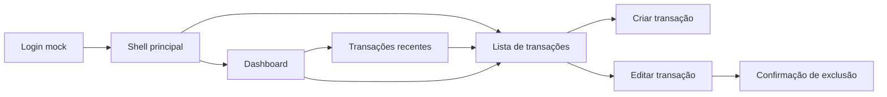
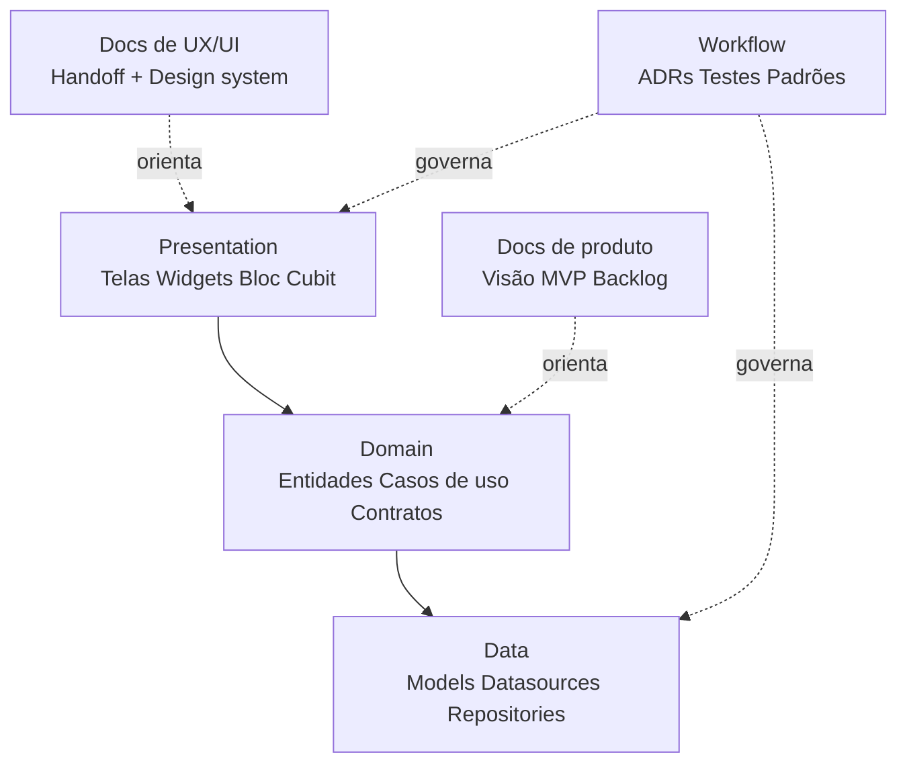
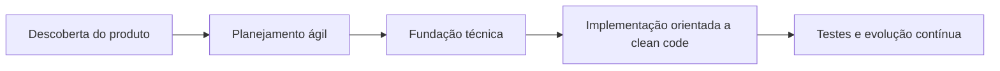

#  FinTrack

<p align="center">
  
</p>

FinTrack é um aplicativo de finanças pessoais em Flutter, em desenvolvimento, com foco em ajudar usuários a acompanhar receitas, despesas e saldo em uma experiência mobile simples.

<p align="center">
	
</p>

## Resumo executivo

O projeto foi estruturado como um case de portfólio em Flutter para demonstrar capacidade de transformar uma ideia de produto em um fluxo de engenharia bem documentado, com visão funcional, decisão técnica, organização de backlog e referência visual pronta para implementação.

Para leitura de recrutadores e avaliadores técnicos, o repositório foi pensado para evidenciar raciocínio de produto, organização de arquitetura, clareza documental e preparo para evoluir de scaffold inicial para um MVP consistente.

### Destaques do projeto

- proposta de valor clara para controle de receitas e despesas
- documentação funcional, técnica e visual organizada em [docs/](docs/)
- protótipo de UX/UI consolidado com handoff e design system
- roadmap orientado a MVP, arquitetura em camadas e qualidade de código
- material estruturado para demonstrar processo, não apenas código final

## Status

O projeto está em desenvolvimento ativo, com entregas incrementais validadas até a Sprint 4.

**Progresso até o momento:**
- MVP funcional parcial: autenticação mock, shell principal, dashboard com resumo financeiro, transações recentes, cadastro/edição/exclusão de transações e categorias padrão.
- Estrutura multiplataforma validada (Android, iOS, Web, Windows, Linux, macOS).
- Cobertura de testes ampliada (widget/unitários).
- Documentação técnica, visual e de produto evoluída em paralelo à implementação.

**Em desenvolvimento:**
- Filtros de transações por categoria, tipo e período.
- Persistência local das transações com `shared_preferences` (ver ADR-003).
- Integração do backend Firebase para autenticação real e sincronização de dados ([ADR-006](docs/adr/adr-006-adocao-firebase.md)).
- Refinamentos visuais e de estados de interface.

## Histórico de entregas por Sprint

### Sprint 0 (Fundação)
- Substituição do app demo por uma shell inicial do FinTrack.
- Definição da estrutura de pastas e tema base.
- Preparação da navegação inicial e smoke tests.
- Início dos padrões de organização do projeto.

### Sprint 1 (Fluxo principal)
- Implementação da autenticação mock.
- Preparação da shell principal com navegação.
- Modelagem da entidade de transação.
- Criação da primeira listagem e formulário inicial.

### Sprint 2 (Proposta de valor do produto)
- Conclusão do CRUD de transações.
- Inclusão de categorias padrão.
- Construção do dashboard com resumo financeiro.
- Conexão dos fluxos principais do usuário.

### Sprint 3 (Fundação técnica e arquitetura)
- Substituição da tela padrão do Flutter pela primeira experiência do FinTrack.
- Estruturação inicial do projeto com separação clara de camadas (Presentation, Domain, Data).
- Modelagem das entidades principais do domínio financeiro.
- Implementação do fluxo de autenticação mock e navegação principal.
- Criação dos primeiros testes de widget e unidade para fluxos críticos.
- Documentação técnica inicial e primeiros ADRs.

### Sprint 4 (Implementação orientada a clean code e evolução)
- Implementação do cadastro, edição e exclusão de transações com categorias padrão.
- Integração dos agregados financeiros (saldo, receitas, despesas) ao dashboard.
- Refino do fluxo de navegação e estados de interface.
- Expansão da cobertura de testes para os novos fluxos implementados.
- Consolidação do handoff visual e atualização da documentação de design.
- Padronização de código, revisão contínua e refatoração incremental.
- Estrutura multiplataforma validada para Android, iOS, Web, Windows, Linux e macOS.

## Visão do produto

O objetivo do FinTrack é oferecer uma forma clara e prática de gerenciar finanças pessoais em um único aplicativo.

A primeira versão está focada no essencial:

- registrar transações de receita e despesa
- acompanhar o saldo atual
- organizar gastos em um fluxo simples e intuitivo

## Funcionalidades implementadas no MVP atual

### 100% implementado
- login mock com entrada em modo demo e logout
- shell principal com navegação entre dashboard e transações
- dashboard com saldo atual, totais de receitas e despesas
- seção de transações recentes com CTA para abrir a listagem completa
- cadastro de transações de receita e despesa
- edição e exclusão de transações com confirmação
- categorias padrão do MVP integradas ao formulário e à listagem
- atualização dos agregados financeiros a partir das transações cadastradas

### Em andamento
- filtros de transações por categoria, tipo e período
- persistência local das transações
- refinamentos visuais e de estados de interface

## Próximas entregas do MVP

- filtros de transações por categoria, tipo e período
- persistência local das transações entre sessões (ADR-003)
- refinamentos visuais da dashboard e estados de interface
- expansão da cobertura de testes para novas iterações

## Preview funcional do MVP

O escopo funcional e visual já está consolidado, mesmo antes da implementação completa da interface.



## Arquitetura pensada para o MVP



## Direção de entrega



## Referência visual

Os principais frames do protótipo já estão versionados no repositório e servem como referência de implementação, revisão de UI e leitura de escopo visual do MVP.

### Galeria do protótipo

| Login mock | Shell principal | Dashboard |
| --- | --- | --- |
|  |  |  |

| Lista de transações | Filtros | Criar transação |
| --- | --- | --- |
|  |  |  |

| Editar transação | Confirmação de exclusão | Estados de interface |
| --- | --- | --- |
|  |  |  |

O conjunto completo de referências visuais e suas correspondências funcionais está documentado em [docs/design/README.md](docs/design/README.md) e [docs/design/ff-designer-handoff.md](docs/design/ff-designer-handoff.md).

## Estado atual do repositório

- aplicativo Flutter funcional com fluxo principal navegável
- autenticação mock com sessão local em memória
- dashboard com resumo financeiro calculado a partir das transações
- listagem de transações com criação, edição, exclusão e categorias padrão
- estrutura multiplataforma gerada para Android, iOS, Web, Windows, Linux e macOS
- testes de widget cobrindo fluxos principais de dashboard e transações
- testes unitários cobrindo cálculo de resumo financeiro e transações recentes
- protótipo visual do MVP documentado em [docs/design/](docs/design/)
- documentação técnica e funcional estruturada para continuidade do projeto

## Stack técnica

- Flutter
- Dart
- Material Design
- arquitetura em camadas orientada a features
- `flutter_bloc` como estratégia de gerenciamento de estado
- `shared_preferences` para persistência local (ver [ADR-003](docs/adr/adr-003-persistencia-local.md))
- `firebase_core`, `firebase_auth`, `cloud_firestore` para backend e autenticação (ver [ADR-006](docs/adr/adr-006-adocao-firebase.md))
- `flutter_test` para testes de widget
- `flutter_lints` para qualidade de código

## Como Executar

### Pre-requisitos

- Flutter SDK instalado
- Dart SDK disponível pelo Flutter
- emulador, simulador, navegador ou dispositivo físico configurado

> **Nota:** O app utiliza persistência local em memória ou via `shared_preferences`. Não há backend ou autenticação real no MVP.

### Executar Localmente

```bash
flutter pub get
flutter run
```

### Executar Testes

```bash
flutter test
```

## Estrutura do projeto

```text
lib/       Código principal da aplicação
test/      Testes de widget e testes unitários
android/   Runner para Android
ios/       Runner para iOS
web/       Target Web
windows/   Target Windows
linux/     Target Linux
macos/     Target macOS
```

## Roadmap

### 1. Descoberta e definição do MVP

- detalhar o problema que o aplicativo resolve e o perfil do usuário
- transformar os objetivos do produto em requisitos funcionais e não funcionais
- priorizar o backlog inicial com foco em entregas pequenas e de alto valor

### 2. Planejamento ágil e organização do projeto

- estruturar o desenvolvimento em etapas incrementais, com escopo claro por entrega
- organizar as funcionalidades em backlog, tarefas técnicas e critérios de aceitação
- acompanhar a evolução do projeto com base em priorização, revisão contínua e adaptação do plano

### 3. Fundação técnica e arquitetura da aplicação

- substituir a tela padrão do Flutter pela primeira experiência do FinTrack
- definir a estrutura inicial do projeto com separação clara de responsabilidades
- modelar as entidades e os fluxos principais do domínio financeiro

### 4. Implementação orientada a clean code

- desenvolver funcionalidades com nomes claros, responsabilidades bem definidas e baixo acoplamento
- manter funções e componentes simples, legíveis e fáceis de evoluir
- aplicar padronização de código, revisão contínua e refatoração incremental

### 5. Qualidade, testes e evolução contínua

- expandir a cobertura de testes conforme as funcionalidades forem implementadas
- validar fluxos críticos da aplicação a cada nova entrega
- evoluir a base do projeto com foco em manutenção, escalabilidade e consistência técnica

### 6. Próximos passos do MVP

- filtros de transações por categoria, tipo e período
- persistência local das transações
- integração do backend Firebase (autenticação real, CRUD, sync)
- refinamentos visuais e de estados de interface

## Documentação detalhada

Para continuidade do projeto, a documentação complementar está centralizada na pasta [docs/](docs/).

- guia de contribuição em [CONTRIBUTING.md](CONTRIBUTING.md)
- visão geral da documentação em [docs/README.md](docs/README.md)
- visão do produto em [docs/product/product-vision.md](docs/product/product-vision.md)
- escopo do MVP em [docs/product/mvp-scope.md](docs/product/mvp-scope.md)
- backlog em alto nível em [docs/product/backlog-overview.md](docs/product/backlog-overview.md)
- arquitetura em [docs/engineering/architecture.md](docs/engineering/architecture.md)
- estrutura do projeto em [docs/engineering/project-structure.md](docs/engineering/project-structure.md)
- padrões de código em [docs/engineering/coding-standards.md](docs/engineering/coding-standards.md)
- gerenciamento de estado em [docs/engineering/state-management.md](docs/engineering/state-management.md)
- estratégia de testes em [docs/engineering/testing-strategy.md](docs/engineering/testing-strategy.md)
- fluxo de desenvolvimento em [docs/engineering/development-workflow.md](docs/engineering/development-workflow.md)
- documentação visual em [docs/design/README.md](docs/design/README.md)
- handoff visual e mapeamento de frames em [docs/design/ff-designer-handoff.md](docs/design/ff-designer-handoff.md)
- decisões técnicas centralizadas em [docs/adr/](docs/adr/)
- especificações funcionais em [docs/features/](docs/features/)
- evolução futura em [docs/future/](docs/future/)

## Documentação visual

O handoff de UX/UI do protótipo está organizado em [docs/design/](docs/design/) para apoiar implementação e revisão visual.

- índice visual em [docs/design/README.md](docs/design/README.md)
- handoff do protótipo em [docs/design/ff-designer-handoff.md](docs/design/ff-designer-handoff.md)
- design system observado em [docs/design/design-system.md](docs/design/design-system.md)
- especificação de telas em [docs/design/screen-specs.md](docs/design/screen-specs.md)
- inventário de assets em [docs/design/assets-inventory.md](docs/design/assets-inventory.md)

## Release Notes

Consulte o histórico consolidado de entregas e escopo da release mais recente em [RELEASE_NOTES.md](RELEASE_NOTES.md).

## Por que este projeto

Este repositório faz parte de um portfólio em Flutter e está sendo desenvolvido para demonstrar fundamentos de desenvolvimento mobile, visão de produto, capacidade de documentação técnica e maturidade de estruturação de um projeto antes mesmo da fase intensa de implementação.

Mais do que um app de finanças em construção, o FinTrack evidencia processo, arquitetura, documentação e evolução incremental. O projeto demonstra:
- definição de escopo e organização do trabalho
- consolidação de UX/UI e handoff visual
- decisões arquiteturais registradas em ADRs
- preparação para execução incremental de um MVP realista
- clareza documental para facilitar onboarding, avaliação técnica e continuidade
