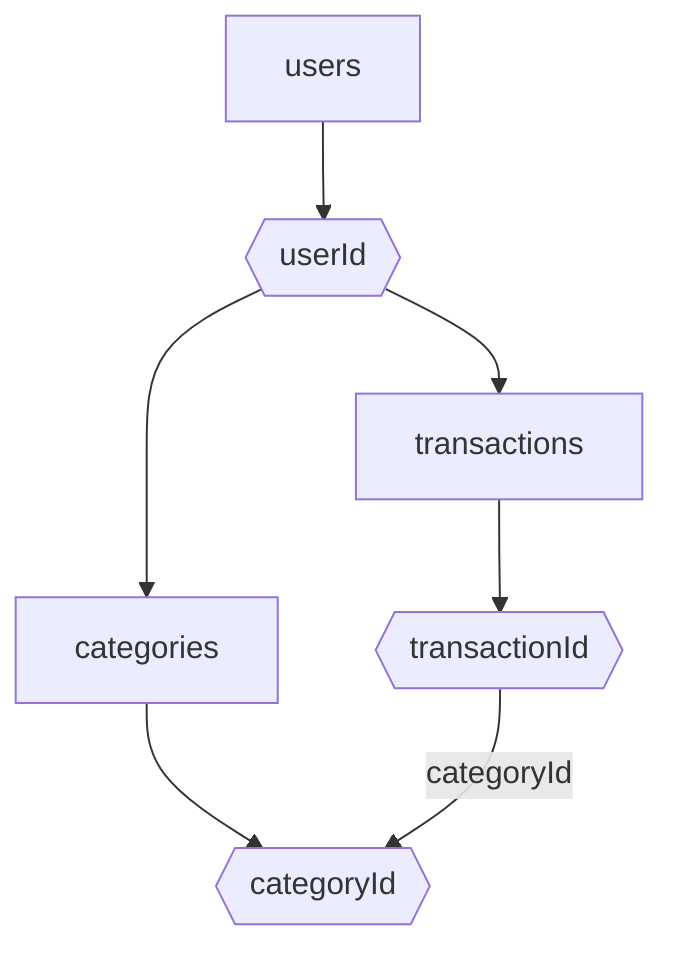

# Modelagem do Banco de Dados Firestore - FinTrack

## Estrutura Geral

- users (coleção)
  - {userId} (documento)
    - profile (subcoleção ou campos no doc)
    - transactions (subcoleção)
      - {transactionId} (documento)
        - amount: number
        - type: 'income' | 'expense'
        - categoryId: string
        - categoryLabel: string
        - date: timestamp
        - description: string
        - createdAt: timestamp
        - updatedAt: timestamp
    - categories (subcoleção)
      - {categoryId} (documento)
        - label: string
        - type: 'income' | 'expense'
        - color: string (opcional)

## Diagrama Mermaid

## Observações
- Cada usuário tem suas próprias transações e categorias.
- As categorias podem ser customizadas por usuário.
- O campo categoryId em transactions referencia o documento de categoria.
- Dados de perfil podem ser armazenados no doc do usuário ou em subcoleção.
- Permite fácil aplicação de regras de segurança por userId.
