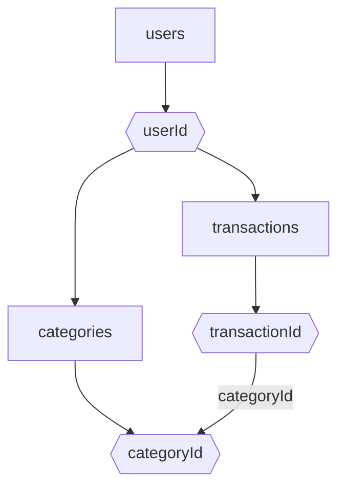

# Modelagem do Banco de Dados Firestore - FinTrack

## Estrutura Geral

- users (coleção)
  - {userId} (documento)
    - transactions (subcoleção)
      - {transactionId} (documento)
        - amount: number
        - type: 'income' | 'expense'
        - categoryId: string
        - categoryLabel: string
        - categoryType: 'income' | 'expense'
        - date: timestamp
        - description: string
        - updatedAt: timestamp
    - categories (subcoleção)
      - {categoryId} (documento)
        - label: string
        - type: 'income' | 'expense'

## Diagrama Mermaid

## Observações

- Cada usuário tem suas próprias transações e categorias.
- O app autenticado atualmente garante um catálogo remoto inicial por usuário em `users/{userId}/categories` com as categorias padrão do MVP.
- As categorias podem evoluir para customização mais rica por usuário em uma etapa posterior, sem alterar a estrutura base já adotada.
- O campo categoryId em transactions referencia o documento de categoria.
- O backend atual nao persiste documento de perfil próprio do usuário; esse espaço permanece como evolução futura.
- Permite fácil aplicação de regras de segurança por userId.
- O campo updatedAt tambem funciona como base para deteccao de conflito em edicoes concorrentes de transacoes.
